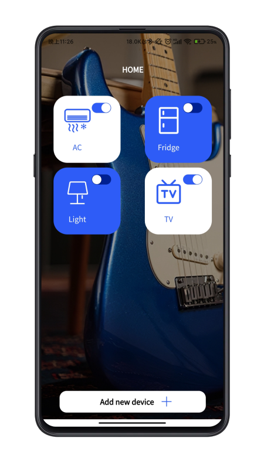

# SmartHome-MQTT-uniapp

## uniapp-demo

>The supporting uniapp supports MQTT communication

## Related Link

- [ESP32-WIFI-MESH-SmartHome](https://github.com/Gitshaoxiang/ESP32-WIFI-MESH-SmartHome)

